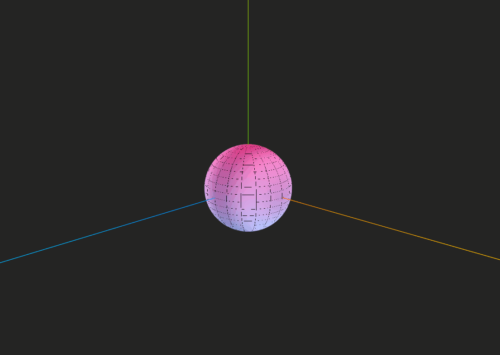

# 🧪 Sombras Personalizadas: Primeros Shaders en Unity y Three.js

## 📅 Fecha
`2025-05-23` – Fecha de realización

---

## 🎯 Objetivo del Taller

Introducir la creación de shaders personalizados para modificar visualmente materiales en tiempo real, comprendiendo la estructura básica de un shader y aplicando efectos visuales mediante código sobre una esfera.


---

## 🧠 Conceptos Aprendidos

Lista los principales conceptos aplicados:

- [x] Shaders y efectos visuales
- [x] Materiales
-

---

## 🔧 Herramientas y Entornos

Especifica los entornos usados:

- Visual Studio Codde
- Three.js / React Three Fiber


---

## 📁 Estructura del Proyecto

```
2025-05-23_taller_shaders_basicos_unity_threejs/
├── threejs/               #  threejs/, entorno de ejecución
    ├── public/                 # Gif
    ├── src/                 # Código fuente
        ├── components/            # Carpeta de los componentes
            ├── AnimatedSphere/            # Esfera animada
├── README.md
```


---

## 🧪 Implementación

Explica el proceso:

### 🔹 Etapas realizadas
1. Creación componente.
2. Creación shader.
3. Asignar el material al componente.
4. Visualizar el componente con el shader y guardar los resultados.

### 🔹 Código relevante

Fragmento que resume el corazón del taller:

```js
// Fragment Shader
const fragmentShader = `
uniform float uTime;
varying vec2 vUv;
varying vec3 vPosition;

void main() {
  // Gradiente basado en posición UV
  vec3 colorA = vec3(0.5, 0.8, 1.0);
  vec3 colorB = vec3(1.0, 0.3, 0.6);
  vec3 gradient = mix(colorA, colorB, vUv.y);
  
  // Efecto de onda animado
  float wave = sin(vPosition.x * 5.0 + uTime * 2.0) * 0.1;
  gradient += wave;
  
  // Efecto wireframe simple
  float wire = step(0.98, mod(vUv.x * 20.0, 1.0)) + step(0.98, mod(vUv.y * 20.0, 1.0));
  wire = clamp(wire, 0.0, 1.0);
  
  // Mezcla final
  gl_FragColor = vec4(mix(gradient, vec3(0.0), wire), 1.0);
}
`
```

---

## 📊 Resultados Visuales

### 📌 un GIF animado:





---

## 🧩 Prompts Usados

Prompts utilizados:

```text
"Crea un shader el cual cambie el color para esta esfera"
```

---

## 💬 Reflexión Final

Responde en 2-3 párrafos:

- ¿Qué aprendiste o reforzaste con este taller? A como aplicar un shader
- ¿Qué parte fue más compleja o interesante? Ver los efectos que se pueden aplicar sobre los elementos
- ¿Qué mejorarías o qué aplicarías en futuros proyectos? Crear un shader más complejo

---

## 👥 Contribuciones 

Describe exactamente lo que hiciste tú:

```markdown
- Programé el componente de la esfera
- Generé los GIFs y documentación
- Integré el shader generado por modelos de IA.
```

---

## ✅ Checklist de Entrega

- [x] Carpeta `YYYY-MM-DD_nombre_taller`
- [x] Código limpio y funcional
- [x] GIF incluido con nombre descriptivo (si el taller lo requiere)
- [x] Visualizaciones o métricas exportadas
- [x] README completo y claro
- [x] Commits descriptivos en inglés

---