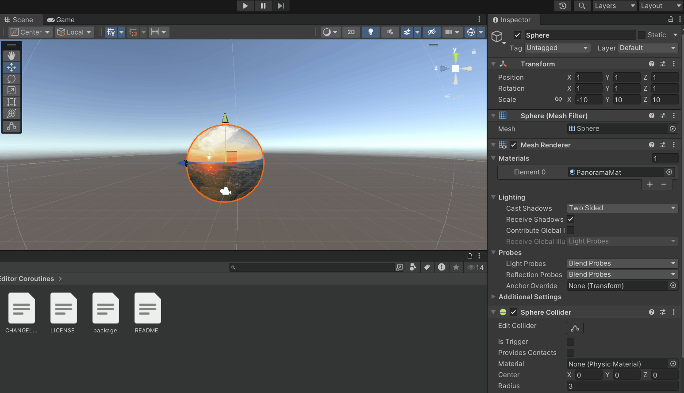

# 🧪  Visualización de Imágenes y Video 360° en Unity y Three.js

## 📅 Fecha
`2025-05-23` – Fecha de realización

---

## 🎯 Objetivo del Taller

Aprender a cargar e integrar imágenes panorámicas (equirectangulares) y videos 360° dentro de entornos 3D inmersivos usando Unity y Three.js con React sobre una esfera y usando orbit controlos para moverse adentro.


---

## 🧠 Conceptos Aprendidos

Lista los principales conceptos aplicados:

- [x] Imágenes panorámicas
- [x] Videos 360
- [x] Entornos 3D

---

## 🔧 Herramientas y Entornos

Especifica los entornos usados:

- Visual Studio Codde
- Three.js / React Three Fiber
- Unity hub
- C#


---

## 📁 Estructura del Proyecto

```
2025-05_23_taller_imagenes_video_360/
├── threejs/               #  threejs/, entorno de ejecución
    ├── public/                 # Gifs e panoramas y videos 360
    ├── src/                 # Código fuente
        ├── components/            # Carpeta de los componentes
            ├── PanoramaScene.jsx/            # Escena componente imagen 360
            ├── PanoramaScene.jsx/            # Escena componente video 360
├── unity/               #  unity/, entorno de ejecución
  ├── Assets/               #  Todos los assets de los proyectos imagen360 y video360
  ├── Scripts/               #  Archivos C# usados
├── README.md
```


---

## 🧪 Implementación

Explica el proceso:

### 🔹 Etapas realizadas
1. Descargar imagen y video 360.
2. Creación esfera en threejs y aplicar la textura panorámica.
3. A la misma esfera crear un elemento video HTML oculto usar videoTexture como mapa de material.
4. Visualizar el la iamgen y el video en la esfera y guardar los resultados.
5. Crear proyecto en unity para imagen360
6. Crear esfera en unity, importar la imagen360 y aplicar configuraciones necesarias.
7. Crear proyecto video360, importar video360 y crear script para aplicarlo a la esfera y relacionar el video con la esfera.
8. Visualizar resultados y guardar.

### 🔹 Código relevante

Fragmento que resume el corazón del taller:

```js
// Memoizamos la creación del elemento video y del VideoTexture
  const { video, texture } = useMemo(() => {
    // 1) Crear un elemento <video> oculto
    const vid = document.createElement('video');
    vid.src = '/video360.mp4';   // ruta en public/
    vid.crossOrigin = 'Anonymous';
    vid.loop = true;
    vid.muted = true;            // algunos navegadores bloquean autoplay sin mute
    vid.playsInline = true;      // para iOS
    vid.play();

    // 2) Crear la VideoTexture
    const tex = new THREE.VideoTexture(vid);
    tex.minFilter = THREE.LinearFilter;
    tex.magFilter = THREE.LinearFilter;
    tex.format = THREE.RGBFormat;

    return { video: vid, texture: tex };
  }, []);

  // Opcional: actualizar manualmente la textura cada frame
  useFrame(() => {
    if (texture) {
      texture.needsUpdate = true;
    }
  });

  useEffect(() => {
    // Limpiar al desmontar
    return () => {
      texture.dispose();
      video.pause();
      video.src = '';
    };
  }, [texture, video]);

  return (
    <>
      {/* Esfera invertida para video 360° */}
      <mesh ref={meshRef} scale={[-1, 1, 1]}>
        <sphereGeometry args={[10, 60, 40]} />
        <meshBasicMaterial map={texture} side={THREE.BackSide} toneMapped={false} />
      </mesh>
```

---

## 📊 Resultados Visuales

### 📌 GIFs animado:





---

## 🧩 Prompts Usados

Prompts utilizados:

- Como cargo una imagen 360 en threejs
- Como cargo un video 360 en threejs
- Como cargo una imagen 360 en Unity
- Como cargo un video 360 en Unity


---

## 💬 Reflexión Final

Responde en 2-3 párrafos:

- ¿Qué aprendiste o reforzaste con este taller? A como cargar imagenes y videos 360 en varios entornos
- ¿Qué parte fue más compleja o interesante? Cargar el video 360 en unity
- ¿Qué mejorarías o qué aplicarías en futuros proyectos? Mejorar la visualización de los elementos cargados, porque los limites de los imagenes y videos se ven mal.

---

## 👥 Contribuciones 

Describe exactamente lo que hiciste tú:

```markdown
- Busque e integre la imagen y el video 360
- Cree las esferas en cada entorno e implemente orbit controls en threejs
- Integré el código generado por modelos de IA.
- Generé documentación y GIFS.
```

---

## ✅ Checklist de Entrega

- [x] Carpeta `2025-05_23_taller_imagenes_video_360`
- [x] Código limpio y funcional
- [x] GIF incluido con nombre descriptivo 
- [x] Visualizaciones o métricas exportadas
- [x] README completo y claro
- [x] Commits descriptivos en inglés

---