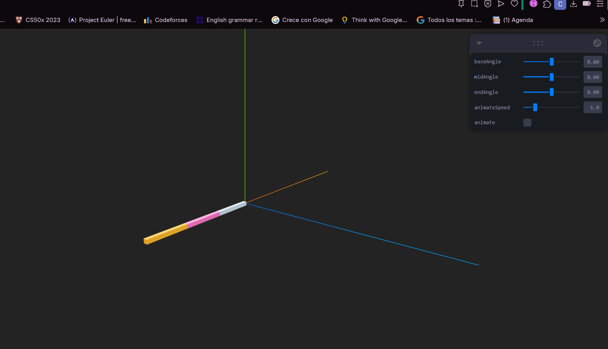

# 🧪 Taller - Cinemática Directa: Animando Brazos Robóticos o Cadenas Articuladas


## 📅 Fecha
`2025-06-07` – Fecha de realización

---

## 🎯 Objetivo del Taller

Aplicar conceptos de cinemática directa (Forward Kinematics) para animar objetos enlazados como criaturas segmentadas. El objetivo es comprender cómo rotaciones encadenadas afectan el movimiento y la posición de cada parte en una estructura jerárquica en Threejs.

---

## 🧠 Conceptos Aprendidos

Lista los principales conceptos aplicados:

- [x] Cinemática directa
- [x] Objetos enlazados
- [x] Rotaciones encadenadas
- [x] Jerarquias en grupos de meshs


---

## 🔧 Herramientas y Entornos

Especifica los entornos usados:

- Visual Studio Codde
- Three.js / React Three Fiber


---

## 📁 Estructura del Proyecto

```
2025-06-07_taller_cinematica_directa_fk/
├── threejs/               #  threejs/, entorno de ejecución
    ├── public/                 # Gif
    ├── src/                 # Código fuente
        ├── components/            # Carpeta de los componentes
            ├── Arm.jsx/            #  Componente brazo
├── README.md
```


---

## 🧪 Implementación

Explica el proceso:

### 🔹 Etapas realizadas
1. Crear meshs conectados a un grupo
2. Aplicar rotaciones progresivas 
3. Implementar una linea que trace el movimiento.
4. Visualizar el resultado y guardar los resultados.


### 🔹 Código relevante

Fragmento que resume el corazón del taller:

```js
export default function Arm() {
  const baseRef = useRef();
  const midRef = useRef();
  const endRef = useRef();
  const [points, setPoints] = useState([]);
  const maxPoints = 200;

  const {
    baseAngle = 0,
    midAngle = 0,
    endAngle = 0,
    animateSpeed = 1,
    animate = false
  } = useControls({
    baseAngle: { value: 0, min: -Math.PI, max: Math.PI, step: 0.01 },
    midAngle: { value: 0, min: -Math.PI, max: Math.PI, step: 0.01 },
    endAngle: { value: 0, min: -Math.PI, max: Math.PI, step: 0.01 },
    animateSpeed: { value: 1, min: 0.1, max: 5, step: 0.1 },
    animate: false
  });

  useFrame(({ clock }) => {
    const t = clock.getElapsedTime() * animateSpeed;
    const a1 = animate ? Math.sin(t) : baseAngle;
    const a2 = animate ? Math.sin(t * 1.2) : midAngle;
    const a3 = animate ? Math.sin(t * 1.5) : endAngle;

    if (baseRef.current) baseRef.current.rotation.z = a1;
    if (midRef.current) midRef.current.rotation.z = a2;
    if (endRef.current) endRef.current.rotation.z = a3;

    const pos = new THREE.Vector3();
    endRef.current.getWorldPosition(pos);

    setPoints((prev) => {
      const next = [...prev, [pos.x, pos.y, pos.z]];
      if (next.length > maxPoints) next.shift();
      return next;
    });
  });

  return (
    <>
      <group ref={baseRef}>
        <mesh position={[1, 0, 0]}>
          <boxGeometry  args={[2, 0.2, 0.2]} />
          <meshStandardMaterial color="orange" />
        </mesh>
        <group ref={midRef} position={[2, 0, 0]}>
          <mesh position={[1, 0, 0]}>
            <boxGeometry  args={[2, 0.2, 0.2]} />
            <meshStandardMaterial color="hotpink" />
          </mesh>
          <group ref={endRef} position={[2, 0, 0]}>
            <mesh position={[1, 0, 0]}>
              <boxGeometry  args={[2, 0.2, 0.2]} />
              <meshStandardMaterial color="lightblue" />
            </mesh>
          </group>
        </group>
      </group>
      {points.length > 1 && <Line points={points} lineWidth={2} color="white" />}
    </>
  );
}

```

---

## 📊 Resultados Visuales

### 📌 GIFs animado:





---

## 🧩 Prompts Usados

Prompts utilizados:

- Como hago un brazo con segmentos con meshs en un group
- Como uso useFrame
- Agrega sliders con leva a este código


---

## 💬 Reflexión Final

Responde en 2-3 párrafos:

- ¿Qué aprendiste o reforzaste con este taller? Creé un brazó con movimiento
- ¿Qué parte fue más compleja o interesante? Ver el brazo segmentado en movimiento
- ¿Qué mejorarías o qué aplicarías en futuros proyectos? Aplicar a modelo de un brazo
---

## 👥 Contribuciones 

Describe exactamente lo que hiciste tú:

```markdown
- Programé los movimientos del brazo
- Integré el código generado por modelos de IA.
- Generé documentación y GIFS.
```

---

## ✅ Checklist de Entrega

- [x] Carpeta `2025-06-07_taller_cinematica_directa_fk`
- [x] Código limpio y funcional
- [x] GIF incluido con nombre descriptivo 
- [x] Visualizaciones o métricas exportadas
- [x] README completo y claro
- [x] Commits descriptivos en inglés

---