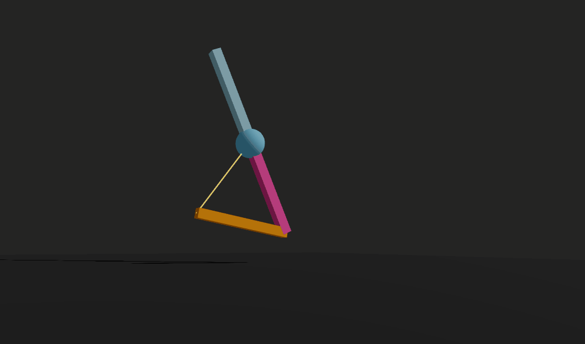

    # 🧪 Taller - Cinemática Inversa: Haciendo que el Modelo Persiga Objetivos


    ## 📅 Fecha
    `2025-06-07` – Fecha de realización

    ---

    ## 🎯 Objetivo del Taller

    Aplicar cinemática inversa (IK, Inverse Kinematics) para que un modelo 3D alcance un punto objetivo dinámico, como un brazo  intentando alcanzar una esfera. Este ejercicio permite comprender cómo una cadena de articulaciones puede ajustarse automáticamente para alcanzar una posición deseada usando algoritmos como CCD o FABRIK.
    ---

    ## 🧠 Conceptos Aprendidos

    Lista los principales conceptos aplicados:

    - [x] Cinemática inversa
    - [x] Algoritmo CCD
    - [x] Modelos 3D
    - [x] Animación


    ---

    ## 🔧 Herramientas y Entornos

    Especifica los entornos usados:

    - Visual Studio Codde
    - Three.js / React Three Fiber


    ---

    ## 📁 Estructura del Proyecto

    ```
    2025-06-07_taller_cinematica_inversa_ik/
    ├── threejs/               #  threejs/, entorno de ejecución
        ├── public/                 # Gif
        ├── src/                 # Código fuente
            ├── components/            # Carpeta de los componentes
                ├── ArmLinks.jsx/            #  Componente brazo
                ├── ArmWithCCD.jsx/            #  Componente de background
                ├── BackgroundPlane.jsx/            #  Componente brazo
                ├── DraggableSphere.jsx/            #  Componente esfera
                ├── LevaSphere.jsx/            #  Componente esfera con leva
    ├── README.md
    ```


    ---

    ## 🧪 Implementación

    Explica el proceso:

    ### 🔹 Etapas realizadas
    1. Crear meshs conectados a un grupo
    2. Calcular el vector desde extremo del brazo al objetivo
    3. Implementar CCD
    3. Implementar una linea que trace la trayectoria la objetivo.
    4. Visualizar el resultado y guardar los resultados.


    ### 🔹 Código relevante

    Fragmento que resume el corazón del taller:

    ```js
    export default function ArmWithCCD({ targetRef }) {
    const segmentCount = 3;
    const segmentLength = 2;
    const segmentThickness = 0.2;

    // Array de refs para cada articulación
    const refs = useRef(
        Array(segmentCount).fill().map(() => React.createRef())
    );

    // Estado para la línea que une base y objetivo
    const [points, setPoints] = useState([
        [0, 0, 0],
        [0, 0, 0],
    ]);

    useFrame(() => {
        // Esperar a que target y articulaciones existan
        if (!targetRef?.current) return;
        const joints = refs.current.map(r => r.current);
        const endEff = joints[segmentCount - 1];
        if (joints.some(j => !j) || !endEff) return;

        // Posición del objetivo en coordenadas mundiales
        const targetPos = new THREE.Vector3();
        targetRef.current.getWorldPosition(targetPos);

        // CCD: de la punta a la base
        for (let i = segmentCount - 1; i >= 0; i--) {
        const joint = joints[i];

        // Posición de la articulación y de la punta
        const jointPos = new THREE.Vector3();
        joint.getWorldPosition(jointPos);
        const endPos = new THREE.Vector3();
        endEff.getWorldPosition(endPos);

        // Vectores normalizados
        const toEnd = endPos.clone().sub(jointPos).normalize();
        const toTarget = targetPos.clone().sub(jointPos).normalize();

        // Calcular ángulo entre vectores
        const cos = THREE.MathUtils.clamp(toEnd.dot(toTarget), -1, 1);
        const angle = Math.acos(cos);

        // Eje de rotación
        const axis = toEnd.clone().cross(toTarget).normalize();
        if (axis.length() < 1e-3) continue;

        // Aplicar rotación en quaternion
        const quat = new THREE.Quaternion().setFromAxisAngle(axis, angle);
        joint.quaternion.multiply(quat);
        }

        // Actualizar puntos de la línea
        const basePos = new THREE.Vector3();
        joints[0].getWorldPosition(basePos);

        setPoints([
        [basePos.x, basePos.y, basePos.z],
        [targetPos.x, targetPos.y, targetPos.z],
        ]);
    });

    ```

    ---

    ## 📊 Resultados Visuales

    ### 📌 GIFs animado:


    


    ---

    ## 🧩 Prompts Usados

    Prompts utilizados:

    - Como hago un brazo con segmentos con meshs en un group
    - Como calculo un vector desde el extremo del brazo al objetivo
    - Agrega linea desde el extremo del brazo hacía el objetivo


    ---

    ## 💬 Reflexión Final

    Responde en 2-3 párrafos:

    - ¿Qué aprendiste o reforzaste con este taller? Como animar un brazo con un objetivo presente
    - ¿Qué parte fue más compleja o interesante? Calcular el vector del extremo del brazo al objetivo.
    - ¿Qué mejorarías o qué aplicarías en futuros proyectos? Aplicar a modelo de un brazo
    ---

    ## 👥 Contribuciones 

    Describe exactamente lo que hiciste tú:

    ```markdown
    - Programé los movimientos del brazo
    - Integré el código generado por modelos de IA.
    - Generé documentación y GIFS.
    ```

    ---

    ## ✅ Checklist de Entrega

    - [x] Carpeta `2025-06-07_taller_cinematica_inversa_ik`
    - [x] Código limpio y funcional
    - [x] GIF incluido con nombre descriptivo 
    - [x] Visualizaciones o métricas exportadas
    - [x] README completo y claro
    - [x] Commits descriptivos en inglés

    ---