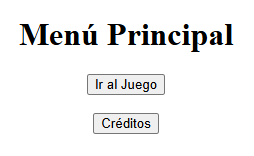
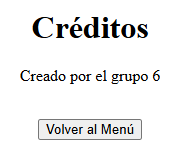

# Taller - Arquitectura de Juego, Escenas y Navegación en Unity y Three.js

Este taller explora cómo construir una arquitectura modular de múltiples escenas, tanto en **Unity** como en **Three.js con React**, con un enfoque en la navegación fluida entre pantallas como menús, juegos y créditos.

---

## Unity - Arquitectura de Escenas

Unity utiliza escenas como contenedores independientes que representan distintos estados del juego: menú, nivel, créditos, etc. En este taller, se crearon tres escenas y se conectaron usando botones UI.

- La navegación entre escenas se realiza usando un sistema de botones que ejecutan llamadas a la API `SceneManager`.
- Cada botón está vinculado a un controlador lógico que permite pasar de una escena a otra con facilidad.
- Esta separación permite que cada pantalla sea desarrollada de forma aislada y luego conectada modularmente.

### Captura de los botones en Unity

---

## Three.js + React - Rutas y Componentes por Escena

En la versión web del proyecto se usó **React Router** para representar escenas como rutas:  
`/` (menú), `/juego`, `/creditos`.

Cada escena está encapsulada como un componente React, y la navegación entre ellas se hace con enlaces (`Link`) y rutas (`Route`). Dentro de la escena de juego se utilizó Three.js para renderizar objetos 3D interactivos en un lienzo `Canvas`.

- La escena `/juego` muestra un entorno 3D con control de cámara, mientras que las otras usan interfaces HTML estándar.
- Esta arquitectura basada en rutas permite escalar fácilmente el proyecto web añadiendo nuevas escenas como nuevos componentes.

### Menú principal (React)

### 📸 Escena de juego 3D (React + Three.js)

### 📸 Créditos (React)

---

## Justificación del flujo y diseño modular

El uso de escenas o componentes separados facilita el mantenimiento y escalabilidad de ambos proyectos. Separar lógicamente cada "pantalla" permite:

- Reutilizar código (por ejemplo, botones y navegación).
- Trabajar en equipo dividiendo tareas por escena.
- Realizar pruebas y cambios sin afectar otras partes del sistema.

Tanto en Unity como en React, se priorizó una arquitectura clara donde cada elemento cumple una función específica y puede evolucionar de forma independiente.

---

## Explicación general del código

El flujo general consiste en:

- En Unity: Se usan métodos públicos que responden a eventos de botones para cambiar entre escenas.
- En React: Se define una ruta por cada escena, con componentes que representan contenido 3D o interfaces estáticas.
- En ambas plataformas, se mantiene una estructura modular, lo que permite añadir o cambiar pantallas sin romper el flujo del proyecto.

---
