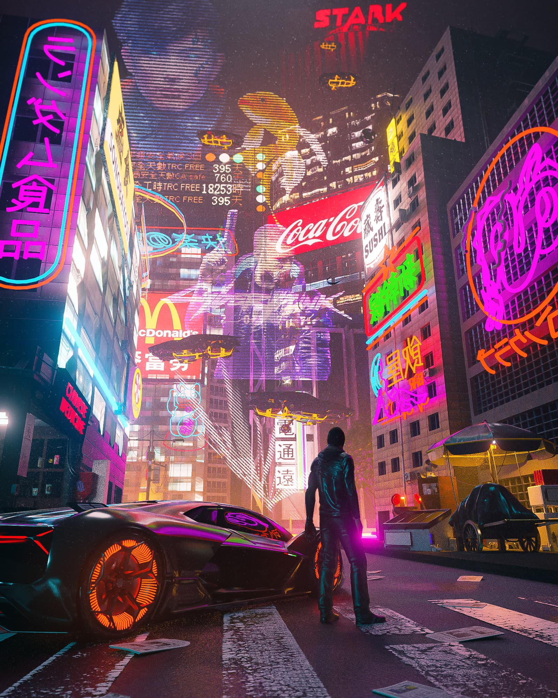
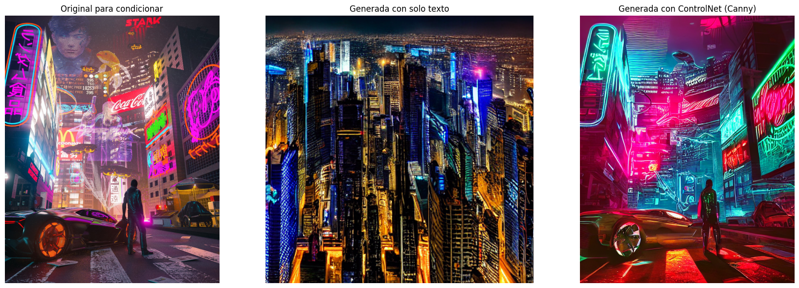
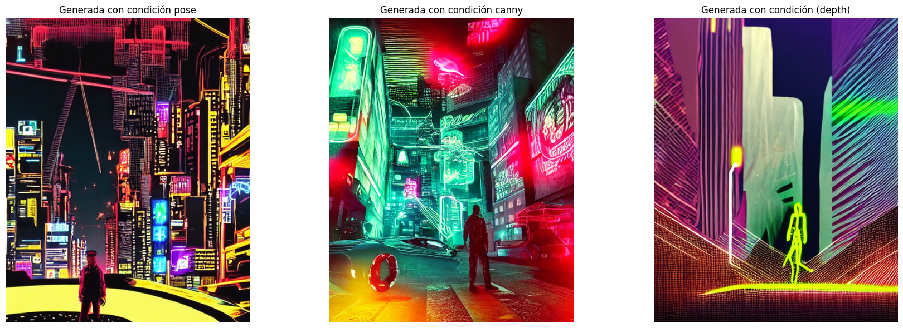

# link colab
https://colab.research.google.com/drive/1FQtb_fNvk8VzAPSLz8D-9KEF_6FLQgwq?usp=sharing
# Tipo de ControlNet usaste.
Se uso canny, depth y pose para tenern diferentes perspectivas sobre como se analiza la imagen
# Imágenes de entrada utilizadas y prompts.
## Imagen de entrada

## Prompts
### Primer promt sin mucho detalle
- A cyberpunk city skyline at night with a car and person with a arm, with neon colors
### Segundo prompt con más detalles
- the downtown from cyberpunk city at night with a car and person with a arm, with neon colors and with fish holograms at the center
# Comparaciones visuales entre imágenes sin y con ControlNet.

# Descripción general de los prompts usados.
Se le dió el objetivo del taller y las indicaciones dadas para desarrollar el taller, sin embargo hubieron varios problemas para importar los modelos usados para pose y depth, así que tocó utilizar otras librerias y también implementar pipelines, luego de poder cargar esto correctamente se le pidio que con matplotlib hiciera un grafico compartivo de las imagenes generadas en cada parte.

# Reflexión: ¿cuál condición controló mejor la estructura? ¿hubo algún resultado inesperado?

En mi opinión el que mejor lo hizo fue el canny, sin embargo el depth reconoce bien la postura del sujeto y con pose se reconoce bastante bien la cantidad de estructuras en la imagen
