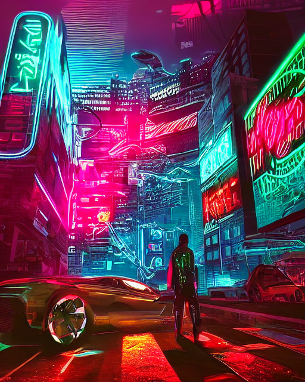
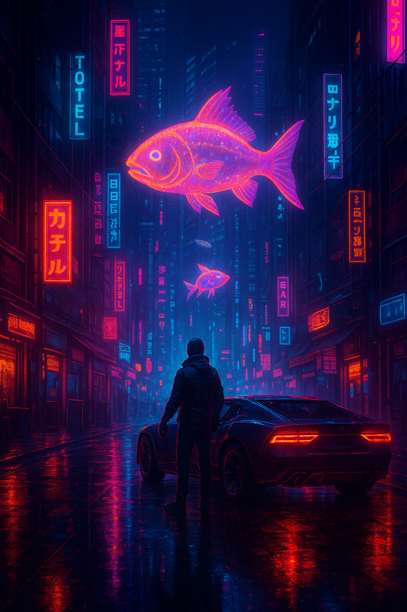

# Descripción del proceso de evaluación
Se cogieron tres imagenes generadas previamente con stable difussion con control net, solo que cada una con diferentes condiciones visuales, por ejmplo canny, depth o pose, y se les hizo comparativas en las métricas de CLIPScore y simetría. Posteriormente se hizo generar en 3 modelos diferentes el mismo prompt, en gpt, en edge y en el modelo que use para stable difussion con control net.
# Link colab
https://colab.research.google.com/drive/1TO4dhbzjjN4xIZJ117ISwZL9ceRlq4rg?usp=sharing
# Comparar varias generaciones para un mismo prompt:
- Prompt: generate an image about the downtown from cyberpunk city at night with a car and person with a arm, with neon colors and with fish holograms at the center
### Imagen generada con stable difussion y controlnet

### Imagen generada con gpt

### Imagen generada con el navegador edge

## ¿Cuál se ve más coherente?
La primera, la que le dí una plantilla con la imagen, ya con este contexto es sumamente precisa
## ¿Cuál es más creativa?
A mí me parece que la más creativa es la generada por edge, tiene un estilo un poco de pintura y más colores
## ¿Hay elementos absurdos o sorprendentes?
Me sorprende lo precisas que fueron las generadas por edge y chrome, ya que no les di una plantilla como si fue con el primer modelo que tenía control net

# Tabla con métricas obtenidas:

| Imagen    | Simetría (SSIM) | CLIPScore |
|-----------|------------------|-----------|
| Imagen 1  | 0.1051           | 0.3548    |
| Imagen 2  | 0.1258           | 0.3006    |
| Imagen 3  | 0.0881           | 0.3599    |

# Fragmentos de reflexión

## ¿Podemos medir arte o creatividad con métricas?
En un punto sí, pero depende del tipo de arte, por ejemplo a veces se busca la armonía en el arte, pero a veces se busca lo caótico, así que no sería acertado evaluar con métricas simplistas el arte, sin embargo, siempre es interesante ver como siempre se mantienen simétrias en las obras de arte. Ya en la creatividad, me parecería que sería interesante probar si algo realmente nuevo.

# Desripción general de los prompts

Se le dió el objetivo del taller y luego se le pidió que me dijiera como cargar un modelo que haga las comparaciones para generar las respectivas métricas de simetría y CLPScore

# Reflexión: ¿fueron útiles las métricas? ¿cómo afecta lo subjetivo en la evaluación visual?
- Las métricas fueron útiles para darme cuenta que la generación de estas imagenes fueron muy precisas a mi prompt, ya si no es lo que esperaba de las imagenes me podrían ayudar a cuenta que quizá el de culpa es mi prompt. 
- La subjetividad es todo, todos tenemos gustos diferentes en los estilos, colores y expectativa visual.
