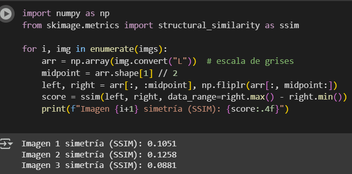
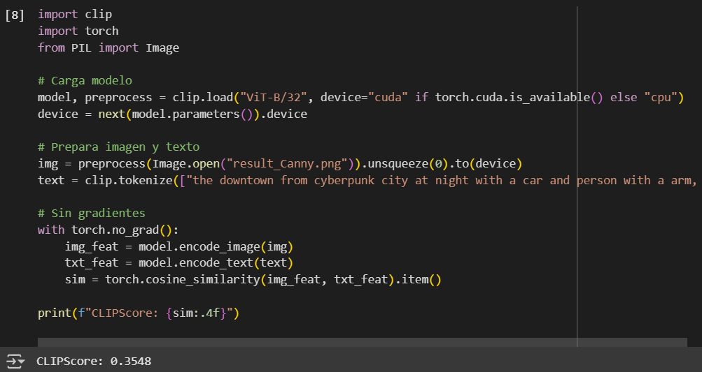
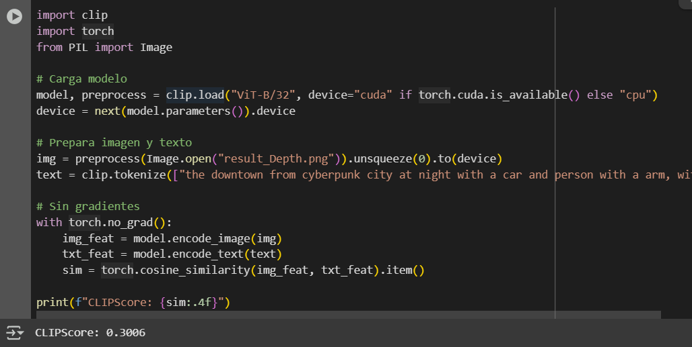
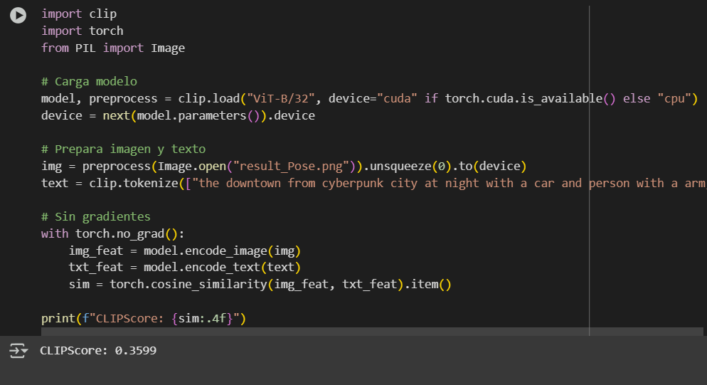

# Tabla con métricas resumidas obtenidas:

| Imagen    | Simetría (SSIM) | CLIPScore |
|-----------|------------------|-----------|
| Imagen 1  | 0.1051           | 0.3548    |
| Imagen 2  | 0.1258           | 0.3006    |
| Imagen 3  | 0.0881           | 0.3599    |

# Pantallazos 
## Simetrias

## Imagen 1

## Imagen 2

## Imagen 3
