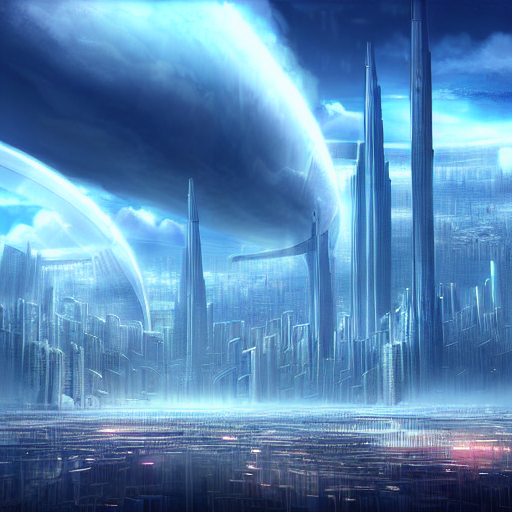
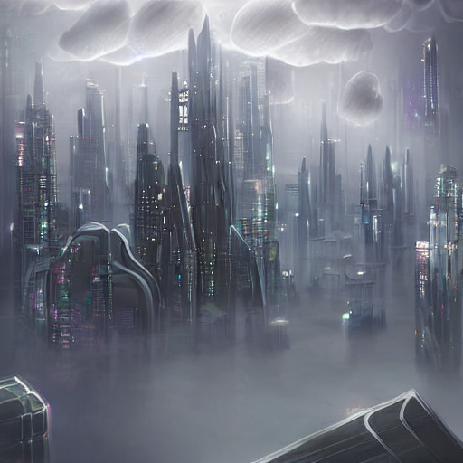
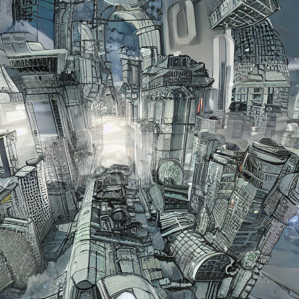
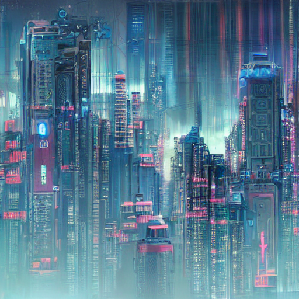
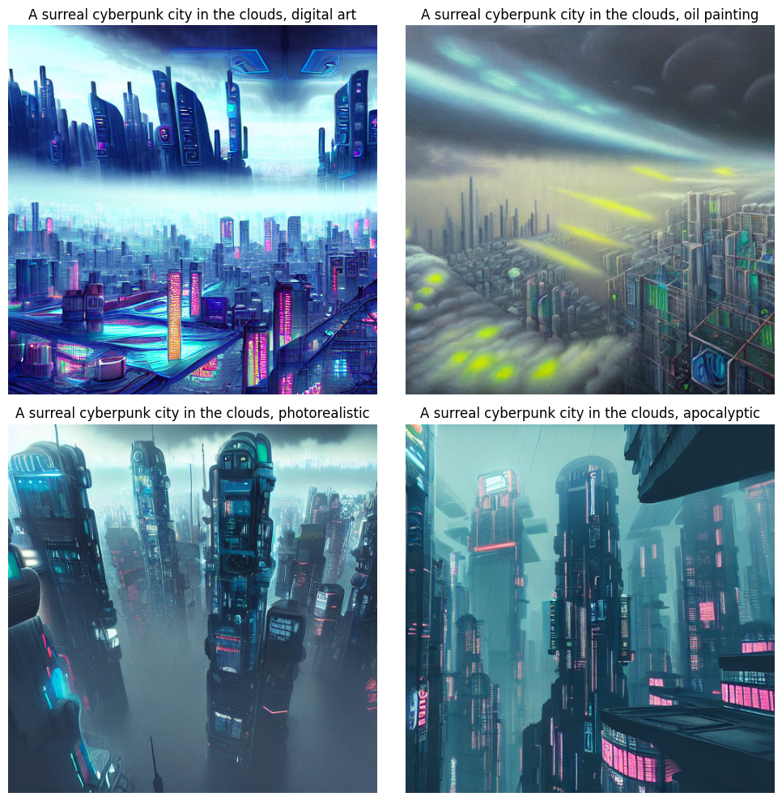

# Descripción del modelo y versión usada.
Desde  StableDiffusionPipeline se trajo stable-diffusion-v1-5, este modelo ya preentrenado, cual a partir de pipe permite alterar los parametros para generar la imagen.
# Lista de prompts utilizados.
- A surreal futuristic city in the clouds, digital art , con num_inference_steps=20, guidance_scale=2.0 es decir con poca precisión
- A surreal futuristic city in the clouds, digital art , con num_inference_steps=50, guidance_scale=7.5 es decir con preción media
- A surreal futuristic city in the clouds, digital art, con num_inference_steps=100, guidance_scale=15 es decir con mucha más precisión
- A surreal cyberpunk city in the clouds, digital art, con una semilla fija
- A surreal cyberpunk city in the clouds, digital art, con num_inference_steps=50, guidance_scale=15
- A surreal cyberpunk city in the clouds, oil painting,
- A surreal cyberpunk city in the clouds, photorealistic,
- A surreal cyberpunk city in the clouds, apocalyptic
- A sleek cyberpunk hovercar speeding through neon-lit rain-soaked streets, cinematic lighting, digital art,
- A retro-futuristic muscle car with glowing neon accents, floating above the highway, concept art,
- An armored electric supercar in a dystopian cityscape, HDR, oil painting style,
- A hyper-realistic chrome sports car drifting in a cyberpunk alley, photorealistic, moody atmosphere

# Imágenes generadas.

# Código principal (o enlace al notebook).
https://colab.research.google.com/drive/1ns9t-NSW2JxFYKq4bi61wwy8of5XqM-I?usp=sharing
# Descripción general de los prompts usados (obligatoria).
Se le cargo el objetivo del taller y las instrucciones dadas, luego de esto se le pidio que buscara en internet para cargar el modelo de forma adecuada, luego que valores poner en los parametros para ver como afectan a las imagenes, después que me diga como guardar los resultados y luego que con matplotlib generar graficos comparativos.

# Reflexión: ¿cómo influye cada parámetro en la imagen final?, ¿qué estilos fueron más satisfactorios?
- Influye mucho los parametros, en la precisión a lo que uno quiere, y en los detalles que esta tendrá.
- Photorealistic con Moody atmosphere y digital art con los parametros altos para obtener una imagen de mayor calidad.

