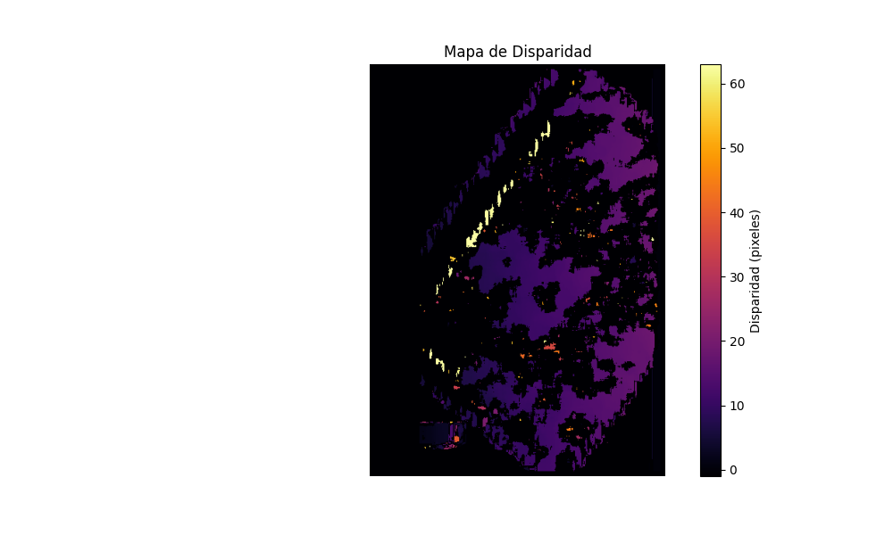

# Reconstrucción 3D Estéreo con Imágenes Satelitales

## Descripción
Este proyecto simula la reconstrucción de un relieve 3D a partir de dos imágenes satelitales estereoscópicas utilizando técnicas de visión computacional. Se genera un mapa de disparidad y posteriormente una malla 3D del terreno estimado.

## Tecnologías Usadas
- OpenCV (StereoBM)
- NumPy
- Matplotlib
- Plotly (visualización 3D)

## Resultados
### Mapa de Disparidad


### Malla 3D Generada
Abrir: [`resultados/malla_3d.html`](resultados/malla_3d.html)

## Reflexión
- **Precisión:** La reconstrucción es aceptable, pero depende mucho de la calidad de la imagen, textura, alineación precisa y ausencia de sombras.
- **Factores Críticos:**
  - Texturas planas producen disparidades ambiguas.
  - Diferencias de iluminación afectan el algoritmo estéreo.
  - La calibración geométrica también es clave para precisión realista.

## Código Destacado

```python
stereo = cv2.StereoBM_create(numDisparities=64, blockSize=15)
disparity = stereo.compute(imgL, imgR).astype("float32") / 16.0
depth_map = 1.0 / (disparity + 1e-6)