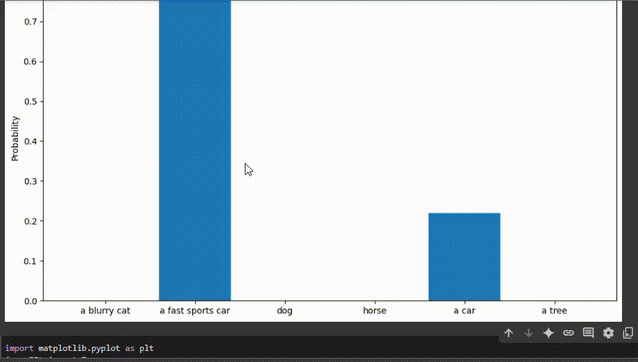

# 🤖 Clasificación Visual y Verbal de Imágenes con CLIP (OpenAI) en Google Colab

## 📅 Fecha
`2025-07-04`

---

## 🎯 Objetivo del Notebook

Explorar el modelo CLIP de OpenAI para clasificar imágenes, combinando procesamiento visual y comprensión textual. Se realiza una clasificación de imágenes (por ejemplo, de un auto) usando etiquetas escritas en lenguaje natural, mostrando probabilidades para cada etiqueta candidata.

---

## 🧠 Conceptos Aprendidos

- [x] Uso del modelo CLIP para clasificación de imágenes con descripciones textuales libres
- [x] Proceso de instalación y carga de modelos pre-entrenados en Colab
- [x] Preprocesamiento de imágenes y textos para modelos de visión+lenguaje
- [x] Interpretación de salidas: probabilidades y predicciones
- [x] Visualización de resultados con Matplotlib

---

## 🔧 Herramientas y Entornos

- Google Colab (Python 3, GPU opcional)
- [CLIP (OpenAI)](https://github.com/openai/CLIP)
- torch, torchvision, numpy, PIL, matplotlib

---

## 📁 Estructura del Notebook

```
Visual_y_Verbal_Clasificación_de_Imágenes_con_CLIP.ipynb
```

---

## 🧪 Implementación

### 🔹 Etapas realizadas

1. Instalación de dependencias: torch, torchvision, ftfy, regex, tqdm, y CLIP desde GitHub.
2. Carga del modelo CLIP y selección de dispositivo (CPU o GPU).
3. Definición de etiquetas en lenguaje natural (ej: `"a blurry cat"`, `"a fast sports car"`, `"dog"`, `"horse"`, `"a car"`, `"a tree"`).
4. Preprocesamiento de la imagen de entrada y de las etiquetas.
5. Extracción de características y cálculo de probabilidades de correspondencia entre la imagen y cada etiqueta.
6. Visualización del resultado y de las probabilidades con Matplotlib.

---

### 🔹 Fragmento real del código para clasificación

```python
import clip
import torch
from PIL import Image

device = "cuda" if torch.cuda.is_available() else "cpu"
model, preprocess = clip.load("ViT-B/32", device=device)
labels = ["a blurry cat", "a fast sports car", "dog", "horse", "a car", "a tree"]
image = preprocess(Image.open("/content/car.jpeg")).unsqueeze(0).to(device)
text = clip.tokenize(labels).to(device)
with torch.no_grad():
    image_features = model.encode_image(image)
    text_features = model.encode_text(text)
    logits_per_image, _ = model(image, text)
    probs = logits_per_image.softmax(dim=-1).cpu().numpy()
```

**Predicción y visualización:**

```python
predicted_label_index = np.argmax(probs)
predicted_label = labels[predicted_label_index]
print(f"The image is classified as: {predicted_label}")
```

**Visualización de probabilidades:**

```python
import matplotlib.pyplot as plt
plt.figure(figsize=(10, 6))
plt.bar(labels, probs[0])
plt.title("Image Classification Probabilities")
plt.ylabel("Probability")
plt.xticks(rotation=0)
plt.tight_layout()
plt.show()
```

---

## 📊 Resultados Visuales



## 🧩 Prompts Usados

```text
¿Cómo uso CLIP de OpenAI para clasificar imágenes con descripciones libres en Google Colab?
¿Cómo obtengo las probabilidades de correspondencia entre una imagen y varias frases usando CLIP?
¿Cómo visualizo los resultados de CLIP en un gráfico de barras?
```

---

## 💬 Reflexión Final

- CLIP es una herramienta muy flexible y poderosa para clasificación visual guiada por texto.
- Es posible usar frases naturales, no solo palabras clave, para describir clases y mejorar la interpretación de resultados.
- Como mejora, se podrían explorar imágenes propias, comparar distintos modelos de CLIP, o usar etiquetas en español.

---

## ✅ Checklist de Entrega

- [x] Notebook funcional y comentado
- [x] Ejemplo de imagen y etiquetas personalizadas
- [x] Visualización de resultados y probabilidades
- [x] README claro y detallado

---