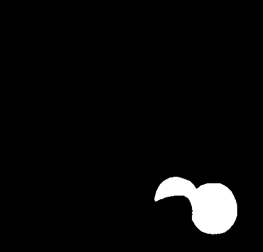

# Informe de Entrega – Taller Práctico #4  
**YOLO + SAM: Detección y Segmentación Avanzada**

## Evidencia Visual del Flujo

### Resultados generales por escenario:

  
  
  

Estos archivos muestran la combinación de detección y segmentación para los tres casos: personas en la calle, frutas en una mesa, y mascotas.

---

### Recortes individuales extraídos:

  
  
  
  
  
  
  
  
  
  

---

### Máscaras segmentadas generadas por SAM:

  
  
  
  
  
  
  
  
  
  

---

## Descripción del Flujo de Trabajo

El pipeline diseñado combina dos potentes modelos preentrenados:

- **YOLOv8 (Ultralytics)** para detección de objetos en la imagen.
- **SAM (Segment Anything Model)** para segmentación precisa a partir de las cajas detectadas.

El flujo sigue estos pasos:

1. **Carga de imagen** desde disco.
2. **Detección de objetos** con YOLO mediante la función `detectar_objetos_yolo(imagen)`.
3. **Segmentación** de cada objeto detectado con la función `segmentar_con_sam(imagen, boxes)` utilizando las cajas como *box prompts*.
4. **Visualización y guardado de resultados**, incluyendo:
   - Máscaras combinadas y por separado.
   - Recortes individuales de cada objeto segmentado.
   - Análisis de área y clase con `analizar_segmentaciones()`.

Bibliotecas clave: `ultralytics`, `segment_anything`, `OpenCV`, `matplotlib`, `numpy`, `Pandas`.

---

## Análisis y Observaciones

- Se detectaron múltiples personas y se generaron máscaras de cuerpo completas.
- En la imagen de frutas, se identificaron **naranjas** y una **banana** con alta precisión.
- Sin embargo, **una piña presente en la imagen no fue detectada**, lo que demuestra que YOLOv8 puede fallar con clases menos comunes en su dataset base.
- En el caso de las mascotas, se identificaron correctamente un **perro** y un **gato**, preservando sus siluetas.
- **Una detección errónea etiquetó una parte de la imagen como "traffic light"**, generando una segmentación innecesaria.

---

## Reflexión Final

Este taller demostró el potencial de combinar modelos de visión por computador avanzados para lograr tareas más completas y detalladas. Algunos aprendizajes:

- **YOLO es rápido y preciso**, pero depende del dataset con el que fue entrenado.
- **SAM es extremadamente eficaz** segmentando formas, incluso cuando las cajas no son perfectas.
- La combinación permite construir aplicaciones más "inteligentes", útiles en medicina, agricultura, seguridad, etc.
- Una limitación importante es el tamaño de los modelos y los recursos de GPU requeridos, especialmente en Colab.

En resumen, la integración de detección y segmentación es un camino prometedor para análisis visual más detallado y aplicaciones prácticas en visión por computador.
