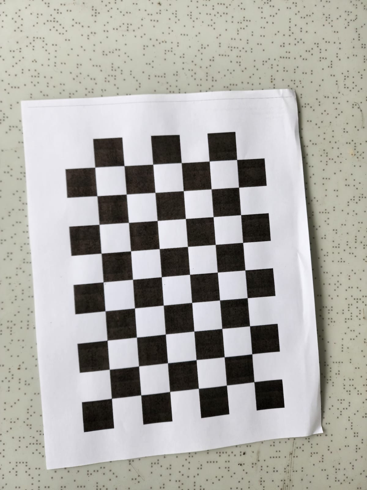
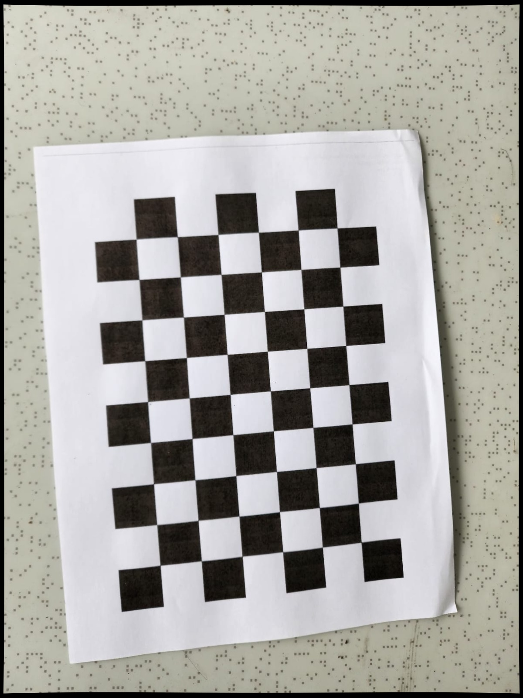

# 📸 Taller Práctico: Calibración de Cámara con OpenCV

Este proyecto corresponde al primer taller práctico del curso y tiene como objetivo aplicar técnicas de calibración de cámara utilizando OpenCV y Python en un entorno de Jupyter Notebook.

Link del taller: https://gitlab.com/anmorenop-computacion-visual/tallerpractico1_calibracion

## 🎯 Objetivo

Implementar un proceso de caibración de cámara usando imágenes de un tablero de ajedrez para obtener los parámetros intrínsecos y extrínsecos, así como coeficientes de distorsión. Se aplica además una corrección visual mediante el modelo calibrado.

## 🗂 Estructura del Proyecto

```
tallerpractico1_calibracion/
├── notebook_calibracion.ipynb   # Notebook principal con el desarrollo del taller
├── .git/                        # Carpeta de control de versiones (Git)
└── .gitignore                   # Archivos y carpetas ignoradas por Git
```

## ⚙️ Requisitos

- Python 3.x
- Jupyter Notebook
- OpenCV
- NumPy
- Matplotlib

Se pueden instalar los requerimientos ejecutando:

```bash
pip install opencv-python numpy matplotlib notebook
```

## 🚀 Instrucciones de Ejecución

1. Abrir una terminal y navegar a la carpeta del proyecto.
2. Ejecutar:

```bash
jupyter notebook
```

4. Abrir el archivo `notebook_calibracion.ipynb` y sigue las instrucciones del taller paso a paso.

## 📷 Descripción del Notebook

El notebook contiene:

- Carga y visualización de imágenes del patrón de calibración.
- Detección de esquinas en el tablero de ajedrez.
- Calibración de la cámara con `cv2.calibrateCamera`.
- Cálculo del error de reproyección.
- Corrección de distorsión en imágenes.

## Pasos Realizados

**Paso 1: Captura de Imágenes**
- Se capturaron 10 imágenes de un tablero de ajedrez desde distintos ángulos y distancias.
- Las imágenes se almacenaron en la carpeta imagenes_originales/.

**Paso 2: Aplicación de Distorsión Artificial**
- Se aplicó una distorsión radial y tangencial intencional a cada imagen.
- Las imágenes distorsionadas se guardaron en la carpeta imagenes_distorsionadas/.

**Ejemplo de comparación**



Imagen Distorsionada



**Paso 3: Detección del Patrón**

- Se detectaron las esquinas internas del tablero en cada imagen distorsionada.
- Las imágenes detectadas se almacenaron en la carpeta imagenes_detectadas/.

**Paso 4: Calibración de la Cámara**

- Se calculó la matriz de calibración y los coeficientes de distorsión.
- Error medio cuadrático de reproyección: 0.11854951656471187

### Resultados:

**Matriz de Calibración:**

[[1.12753139e+03 0.00000000e+00 6.46116386e+02]
[0.00000000e+00 1.12271058e+03 7.74000810e+02]
[0.00000000e+00 0.00000000e+00 1.00000000e+00]]

**Coeficientes de Distorsión:**

[0.0288932, -0.37402329, 0.00254398, -0.00343218, 0.38740943]
    
-**Paso 5: Corrección de las Imágenes**
- Se corrigieron las imágenes distorsionadas utilizando los parámetros obtenidos.
- Las imágenes corregidas se guardaron en la carpeta imagenes_corregidas/.

Ejemplo de comparación:

Imagen Distorsionada


Imagen Corregida


## Preguntas y Respuestas

**¿Cuáles fueron los coeficientes de distorsión obtenidos?:**
 
 [0.0288932, -0.37402329, 0.00254398, -0.00343218, 0.38740943]

**¿Cuántas imágenes fueron necesarias para lograr una calibración aceptable?:**

10 imágenes.

**¿Qué diferencias se observan entre las imágenes corregidas y las distorsionadas?:** 

Las corregidas presentan líneas rectas y proporciones uniformes, mientras que las distorsionadas tienen curvas en los bordes.

**¿Qué aprendiste sobre el uso del patrón de ajedrez y la calibración en visión por computador?:** 

El patrón de ajedrez permite una detección precisa de esquinas para corregir errores ópticos.

La calibración de cámaras corrige distorsiones ópticas y mejora la calidad de las imágenes. El patrón de ajedrez permite obtener parámetros precisos de calibración.
