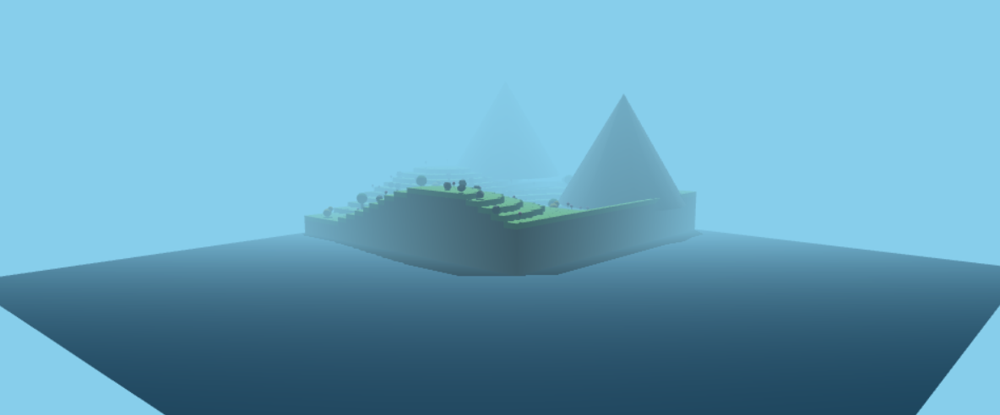
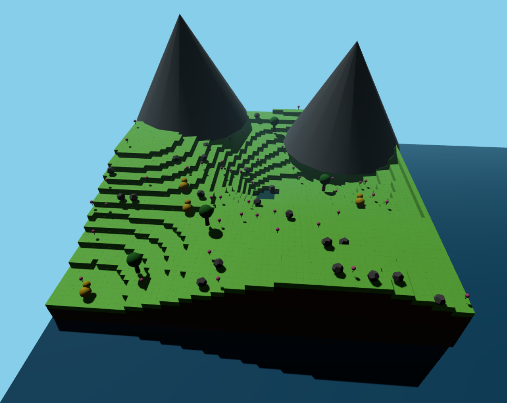
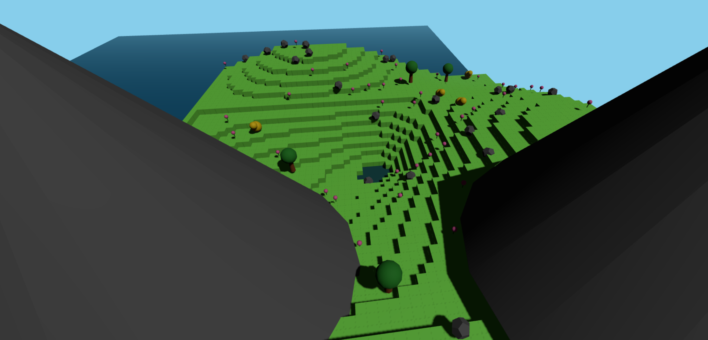

# Informe practica 3

# Capturas del mundo creado





# Ejemplos de funciones usadas
El proyecto implementa diversas funciones para la creación del mundo voxel:

## Funciones principales:
### crearTerreno(ancho, profundidad):

- Genera un terreno voxel con alturas variables usando ruido senoidal
- Crea depresiones para lagos y colinas
- Devuelve el grupo de terreno y mapa de alturas
``` js
export function crearTerreno(ancho = 64, profundidad = 64) {
    const grupoTerreno = new THREE.Group();
    const mapaAlturas = []; // Nuevo: almacenar alturas
    
    // Materiales optimizados
    const materialHierba = new THREE.MeshStandardMaterial({
        color: 0x88ff55,
        roughness: 0.7,
        metalness: 0.1
    });
    
    const materialTierra = new THREE.MeshStandardMaterial({
        color: 0x775544,
        roughness: 0.9,
        metalness: 0.05
    });
    
    // Crear bloques individuales
    for(let x = 0; x < ancho; x++) {
        mapaAlturas[x] = []; // Inicializar fila
        for(let z = 0; z < profundidad; z++) {
            const altura = generarAltura(x, z, ancho, profundidad);
            mapaAlturas[x][z] = altura; // Guardar altura
            
            if(altura > 0) {
                // Bloque de hierba (superficie)
                const bloqueHierba = new THREE.Mesh(
                    new THREE.BoxGeometry(1, 1, 1),
                    materialHierba
                );
                bloqueHierba.position.set(x, altura, z);
                bloqueHierba.castShadow = true;
                bloqueHierba.receiveShadow = true;
                grupoTerreno.add(bloqueHierba);
                
                // Bloques de tierra debajo
                for(let y = 0; y < altura; y++) {
                    const bloqueTierra = new THREE.Mesh(
                        new THREE.BoxGeometry(1, 1, 1),
                        materialTierra
                    );
                    bloqueTierra.position.set(x, y, z);
                    bloqueTierra.castShadow = true;
                    bloqueTierra.receiveShadow = true;
                    grupoTerreno.add(bloqueTierra);
                }
            }
        }
    }
    
    // Centrar el terreno
    grupoTerreno.position.set(-ancho/2, -1, -profundidad/2);
    
    // Crear fondo oceánico
    const aguaGeometry = new THREE.PlaneGeometry(ancho * 2, profundidad * 2);
    const aguaMaterial = new THREE.MeshStandardMaterial({
        color: 0x006994,
        roughness: 0.8,
        metalness: 0.2,
        side: THREE.DoubleSide
    });
    const agua = new THREE.Mesh(aguaGeometry, aguaMaterial);
    agua.rotation.x = -Math.PI / 2;
    agua.position.y = -0.5;
    agua.receiveShadow = true;
    grupoTerreno.add(agua);

    return { 
        terreno: grupoTerreno,
        mapaAlturas  // Nuevo: devolver mapa de alturas
    };
}
```
### generarNaturaleza(terrenoSize, cantidad, mapaAlturas):

- Distribuye entidades naturales sobre el terreno

- Garantiza mínimo 5 animales y 5 árboles

- Usa sistema de posiciones únicas para evitar superposición
```js
export function generarNaturaleza(terrenoSize, cantidad, mapaAlturas) {
    const naturaleza = new THREE.Group();
    const posicionesOcupadas = new Set();
    
    // Función para obtener posición única
    const obtenerPosicionUnica = () => {
        let intentos = 0;
        while (intentos < 100) {
            const posX = Math.random() * terrenoSize - terrenoSize/2;
            const posZ = Math.random() * terrenoSize - terrenoSize/2;
            const clave = `${Math.round(posX)}_${Math.round(posZ)}`;
            
            if (!posicionesOcupadas.has(clave)) {
                posicionesOcupadas.add(clave);
                return { x: posX, z: posZ };
            }
            intentos++;
        }
        return { x: 0, z: 0 };
    };
    
    // Garantizar al menos 5 animales
    for (let i = 0; i < 5; i++) {
        const pos = obtenerPosicionUnica();
        const altura = obtenerAlturaTerreno(pos.x, pos.z, mapaAlturas, terrenoSize);
        if (altura > 0) { // Solo si hay terreno
            const animal = crearAnimal(pos.x, altura, pos.z);
            naturaleza.add(animal);
        }
    }
    
    // Garantizar al menos 5 árboles
    for (let i = 0; i < 5; i++) {
        const pos = obtenerPosicionUnica();
        const altura = obtenerAlturaTerreno(pos.x, pos.z, mapaAlturas, terrenoSize);
        if (altura > 0) {
            const arbol = crearArbol(pos.x, altura, pos.z);
            naturaleza.add(arbol);
        }
    }
    
    // Generar el resto de elementos
    const elementosRestantes = cantidad - 10; // 5 animales + 5 árboles
    
    for (let i = 0; i < elementosRestantes; i++) {
        const tipo = Math.random() > 0.3 ? 'planta' : 'roca';
        const pos = obtenerPosicionUnica();
        const altura = obtenerAlturaTerreno(pos.x, pos.z, mapaAlturas, terrenoSize);
        
        if (altura > 0) {
            if (tipo === 'planta') {
                naturaleza.add(crearPlanta(pos.x, altura, pos.z));
            } else {
                naturaleza.add(crearRoca(pos.x, altura, pos.z));
            }
        }
    }
    
    // Añadir algunas montañas grandes (máximo 3)
    for (let i = 0; i < 2; i++) {
        const pos = obtenerPosicionUnica();
        const altura = obtenerAlturaTerreno(pos.x, pos.z, mapaAlturas, terrenoSize);
        if (altura > 0) {
            const montaña = crearMontaña(pos.x, altura, pos.z);
            naturaleza.add(montaña);
        }
    }
    
    return naturaleza;
}
```
### crearArbol(x, alturaTerreno, z):

- Construye árboles con tronco (cilindro) y copa (esfera)

- Ajusta posición basada en altura del terreno

```js
export function crearArbol(x = 0, alturaTerreno = 0, z = 0) {
    const arbol = new THREE.Group();
    
    // Tronco
    const tronco = new THREE.Mesh(geometrias.tronco, materiales.madera);
    tronco.position.set(0, 1, 0);
    tronco.castShadow = true;
    tronco.receiveShadow = true;
    
    // Copa
    const copa = new THREE.Mesh(geometrias.copa, materiales.hojas);
    copa.position.set(0, 3, 0);
    copa.castShadow = true;
    copa.receiveShadow = true;
    
    arbol.add(tronco);
    arbol.add(copa);
    arbol.position.set(x, alturaTerreno, z);
    
    return arbol;
}

```

### crearAnimal(x, alturaTerreno, z):

- Genera criaturas simples con cuerpo, cabeza y ojos

- Usa geometrías esféricas para partes del cuerpo

```js
export function crearAnimal(x = 0, alturaTerreno = 0, z = 0) {
    const animal = new THREE.Group();
    
    // Cuerpo
    const cuerpo = new THREE.Mesh(geometrias.cuerpo, materiales.piel);
    cuerpo.castShadow = true;
    cuerpo.receiveShadow = true;
    
    // Cabeza
    const cabeza = new THREE.Mesh(geometrias.cabeza, materiales.piel);
    cabeza.position.set(0, 0.5, 0.6);
    cabeza.castShadow = true;
    cabeza.receiveShadow = true;
    
    // Ojos
    const ojoDerecho = new THREE.Mesh(geometrias.ojo, materiales.ojo);
    ojoDerecho.position.set(0.15, 0.55, 0.8);
    ojoDerecho.castShadow = true;
    ojoDerecho.receiveShadow = true;
    
    const ojoIzquierdo = ojoDerecho.clone();
    ojoIzquierdo.position.x = -0.15;
    
    animal.add(cuerpo);
    animal.add(cabeza);
    animal.add(ojoDerecho);
    animal.add(ojoIzquierdo);
    animal.position.set(x, alturaTerreno + 0.5, z); // Ajustar sobre el terreno
    animal.scale.set(1.5, 1.5, 1.5);
    
    return animal;
}
```

# Organización del mundo y elementos contenidos
## Estructura del mundo
### Terreno base: Cuadrícula de 64x64 bloques con variación de altura

### Sistema de capas:

- Capa de tierra bajo la superficie

- Capa de hierba en la superficie

- Fondo oceánico debajo del nivel mínimo

### Elementos naturales:

- Árboles (troncos cilíndricos + copas esféricas)

- Animales (cuerpos esféricos amarillos)

- Plantas (tallos cilíndricos + flores esféricas)

- Rocas (dodecaedros)

- Montañas (conos grandes)

### Cuerpos de agua:

- Lago central con transición suave

- Agua transparente con efecto PBR

### Atmósfera:

- Cielo azul con niebla de distancia

- Iluminación direccional (sol)

- Luz ambiental para relleno
# Ejemplo de cómo se aplicó un material PBR

El proyecto implementa materiales PBR (Physically Based Rendering) para lograr mayor realismo:

## Material de agua (en main.js)

``` js
const aguaMaterial = new THREE.MeshStandardMaterial({
  color: 0x0099FF,                // Color base azul
  transparent: true,               // Permite transparencia
  opacity: 0.8,                    // 80% de opacidad
  roughness: 0.1,                  // Superficie lisa (0 = espejo perfecto)
  metalness: 0.9,                  // Alto metalness para reflejos
  side: THREE.DoubleSide           // Renderiza ambos lados
});
```

## Material de rocas (en entidades.js)
``` js
materiales.roca = new THREE.MeshStandardMaterial({
  color: 0x6C6C6C,                // Color gris pétreo
  roughness: 0.9,                  // Superficie rugosa
  metalness: 0.3,                  // Ligero brillo metálico
});
```

## Características PBR implementadas
- Roughness: Controla la rugosidad de la superficie

- Metalness: Simula comportamiento metálico/no metálico

- Transparencia: Para efectos de agua y vidrios

- Sombras: Todas las entidades proyectan y reciben sombras

- Reflejos: Logrados mediante baja rugosidad y alto metalness

# Reflexión sobre la personalización del mundo y uso de formas primitivas


## Personalización del mundo
El sistema permite una alta personalización mediante:

### Parámetros ajustables:

- Tamaño del terreno (TAMANO_TERRENO)

- Densidad de elementos naturales

- Distribución de biomas

### Sistema modular:

- Cada componente (terreno, entidades, luces) en archivos separados

- Fácil adición de nuevos tipos de entidades

### Generación procedural:

- Terreno único en cada ejecución

- Distribución aleatoria controlada de elementos

### Ajustes visuales:

- Colores fácilmente modificables

- Intensidad de luces configurable

- Niebla ajustable para profundidad


## Uso de formas primitivas
El proyecto aprovecha eficientemente geometrías básicas de Three.js:

### Combinación creativa:

- Árboles = Cilindros + Esferas

- Animales = Esferas múltiples escaladas

- Plantas = Cilindros + Esferas pequeñas

### Ventajas del enfoque:

- Rendimiento: Geometrías simples requieren menos recursos

- Estilo consistente: Mantiene estética voxel/minecraft

- Flexibilidad: Fácil modificación y escalado

- Optimización: Instanciación posible para miles de elementos

### Ejemplo de construcción compleja:
```js
function crearAnimal() {
  // Cuerpo principal (esfera)
  const cuerpo = new THREE.Mesh(geometrias.cuerpo, materiales.piel);
  
  // Cabeza (esfera más pequeña)
  const cabeza = new THREE.Mesh(geometrias.cabeza, materiales.piel);
  cabeza.position.set(0, 0.5, 0.6);
  
  // Ojos (esferas pequeñas)
  const ojo = new THREE.Mesh(geometrias.ojo, materiales.ojo);
  
  // Agrupamiento
  const animal = new THREE.Group();
  animal.add(cuerpo);
  animal.add(cabeza);
  animal.add(ojo);
  return animal;
}
```